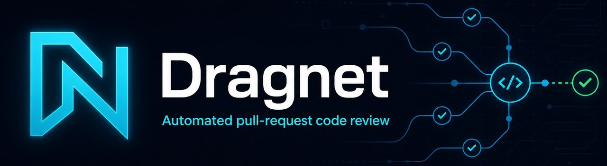

  

# Dragnet Context

## PR workspace

The PR workspace is the user's current working context for examining one pull request. It includes the selected repository and pull request, the files and findings under review, and the current review progress and scan status.

The PR workspace is distinct from repository registration and database configuration. Those are setup concerns outside the user's active review context.

## Pipeline vocabulary

- **Scan finished** — a review run reached a terminal completed state. Not permission to merge.
- **Merge ready** — shared `isMergeReady` gate passed (rating ≥ 8, not skipped, reliability complete/absent, not refused, not stale). Used by prepush, findings, `/dragnet merge`, and the PR header.
- **Blocked** — a named prelude/gate refused work (clone, index, config, diff, …). UI: `Blocked at {gate}`.
- **Not ready** — scan finished or missing but merge gate failed, with a reason.
- **Explicit admit** — UI Run/Force, `/dragnet` prcheck, prepush always enqueue (or join in-flight). Independent of auto-rescan.
- **AFK auto-rescan** — webhook/poller/hosted paths only; gated by auto-rescan policy.

Glanceable seam chips on the PR view: clone · webhook · index · checks · rating.
