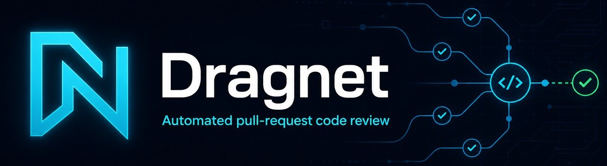

  

<a href="./README.md">README</a> · <a href="./SUPPORT.md">Support</a> · <a href="https://github.com/darrenedward/Dragnet/discussions">Discussions</a>

# Security Policy

Please do not disclose a suspected vulnerability in a public GitHub issue.

Send security reports to `darren-edward@hotmail.com` with:

- a short description of the vulnerability;
- affected versions or commits;
- reproduction steps or a proof of concept;
- potential impact;
- any suggested mitigation.

Please allow reasonable time for investigation and remediation before public disclosure. Do not include passwords, API keys, private repository contents, or other unrelated secrets in a report.

Dragnet is an evolving MVP. Security reports are welcome, but no security response time or warranty is promised.
